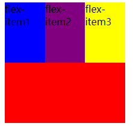
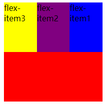
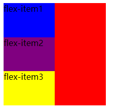

## flex-direction

flex items默认 沿着主轴 从 main-start 到 main-end 方向排布

例如：

```html
<style>
  .flex-container {
    /*开启flex布局  flex:块级元素   inline-flex 行内元素*/
    display: flex;
    background-color: red;
    width: 200px;
    height: 200px;
  }
  .flex-item1 {
    background-color: blue;
    width: 100px;
    height: 100px;
  }
  .flex-item2 {
    background-color: purple;
    width: 100px;
    height: 100px;
  }
  .flex-item3 {
    background-color: yellow;
    width: 100px;
    height: 100px;
  }
</style>


<div class="flex-container">
  <div class="flex-item1">flex-item1</div>
  <div class="flex-item2">flex-item2</div>
  <div class="flex-item3">flex-item3</div>
</div>
```

###### 可以看到：




如果使用了flex-direction：

```html
.flex-container {
  /*开启flex布局  flex:块级元素   inline-flex 行内元素*/
  display: flex;

  /*主轴从右到左*/
  flex-direction: row-reverse;
  background-color: red;
  width: 200px;
  height: 200px;
}
```

###### 可以看到：




###### flex-direction还有其他的值可选用：

```
.flex-container {
  /*开启flex布局  flex:块级元素   inline-flex 行内元素*/
  display: flex;
  
  /*主轴从上到下*/
  flex-direction: column;
  background-color: red;
  width: 200px;
  height: 200px;
}
```


###### 可以看到：




