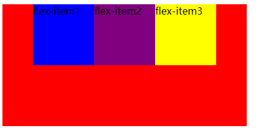
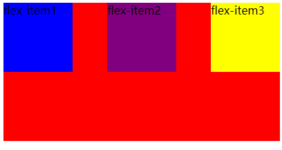
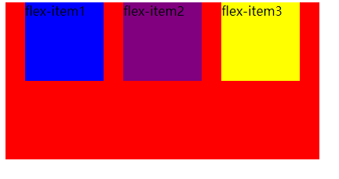

## justify-content

##### 1.flex-start(默认值：和mainstart对齐)

>默认值：和mainstart对齐

``justify-content: flex-start;``

##### 2.flex-end(和main-end对齐)

> 和main-end对齐

``justify-content: flex-end;``

##### 3.center(居中)

> 居中对齐

`justify-content: center;`

##### 4.space-between

> items之间的距离相等
>
> 和 mainstart、mainend两端对齐

##### 5.space-evenly

`justify-content: space-evenly;`

> items之间的距离相等
>
> flex items 和 mainstart mainend 之间的距离等于flex items之间的距离

##### 6.space-around

`justify-content: space-around;`

> items之间的距离相等
>
> flex items 和 mainstart mainend 之间的距离等于flex items之间的距离的一半