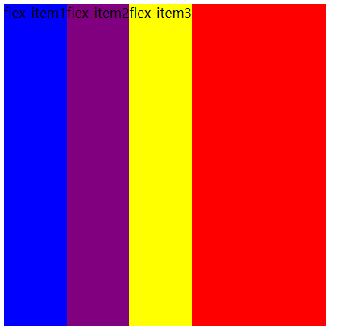
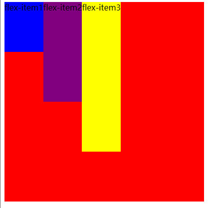
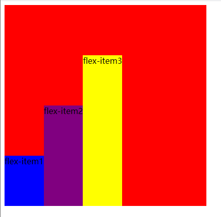
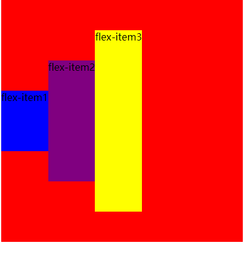
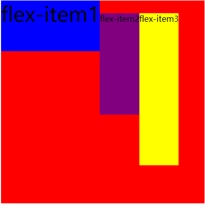

## align-items

##### align-items决定了flex items 在 cross axis上的对齐方式


###### 1.normal

> (默认值) 在弹性布局中 效果和stretch一样


###### 2.strech

> 当 flexitems 在 cross axis 的方向的 size 为 auto 时 会自动拉伸至填充flex container

```html
注意这里的每个items都没有设置高度！
<style>
  .flex-container {
    display: flex;
    justify-content: flex-start;
    align-items: stretch;
    background-color: red;
    width: 400px;
    height: 400px;
  }


  .flex-item1 {
    background-color: blue;
  }

  .flex-item2 {
    background-color: purple;
  }

  .flex-item3 {
    background-color: yellow;
  }
</style>

<body>
<div class="flex-container">
  <div class="flex-item1">flex-item1</div>
  <div class="flex-item2">flex-item2</div>
  <div class="flex-item3">flex-item3</div>
</div>
</body>
```

可以看到:




###### 3.flex-start 和 flex-end

> 与cross start 和 cross end 对齐





###### 4.center 

> 居中对齐



###### 5.baseline

> 和基准线对齐



##### 注意：flex布局里的基准线是第一行文本的最底部