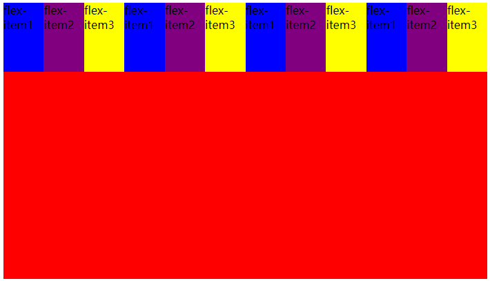
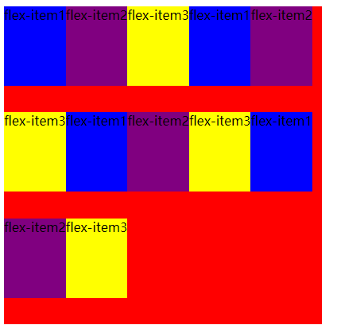
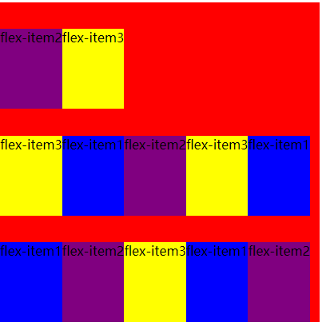

## flex-wrap

###### 1.no-wrap

> 默认情况下 所有的flex items都会在同一行显示

```html
<style>
  .flex-container {
    display: flex;
    background-color: red;
    height: 400px;
    width: 400px;
  }

  .flex-item1 {
    background-color: blue;
    height: 100px;
  }
  .flex-item2 {
    background-color: purple;
    height: 100px;
  }
  .flex-item3 {
    background-color: yellow;
    height: 100px;
  }
  
  <div class="flex-container">
  <div class="flex-item1">flex-item1</div>
  <div class="flex-item2">flex-item2</div>
  <div class="flex-item3">flex-item3</div>
  <div class="flex-item1">flex-item1</div>
  <div class="flex-item2">flex-item2</div>
  <div class="flex-item3">flex-item3</div>
  <div class="flex-item1">flex-item1</div>
  <div class="flex-item2">flex-item2</div>
  <div class="flex-item3">flex-item3</div>
  <div class="flex-item1">flex-item1</div>
  <div class="flex-item2">flex-item2</div>
  <div class="flex-item3">flex-item3</div>
</div>
```





###### 2.wrap

`  flex-wrap: wrap;`




###### 3.wrap-reverse(不常用)

`flex-wrap: wrap-reverse;`




