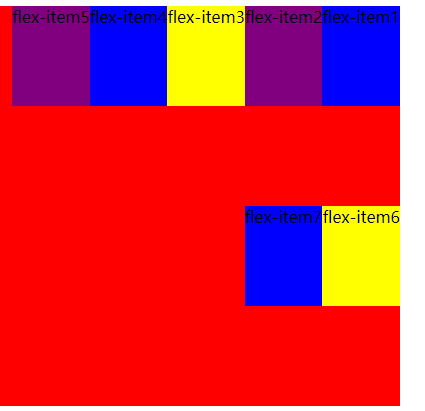

## flex-flow

###### flex-flow 是 flex-direction flex-wrap的简写

###### 例如：

```html
.flex-container {
  display: flex;
  flex-flow: row-reverse wrap;
  background-color: red;
  height: 400px;
  width: 400px;
}
```

可以看到:

