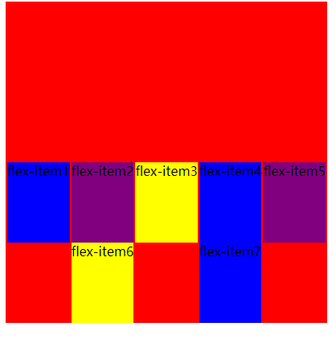
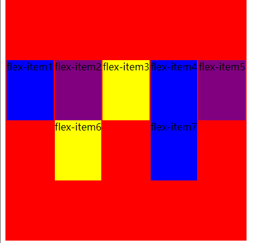

## align-content

###### 决定了多行flex-items 在 cross axis 上的对齐方式 用法和 justify-content 类似

###### 1.scretch(不常用)

> 默认值：类似于 align-items 的 stretch类似
>
> 

##### 2.flex-start(默认值：和mainstart对齐)

>默认值：和mainstart对齐

``align-content: flex-start;``

##### 3.flex-end(和main-end对齐)

> 和main-end对齐

``align-content: flex-end;``

##### 4.center(居中)

> 居中对齐

`align-content: center;`

##### 5.space-between

`align-content: space-between`

> items之间的距离相等
>
> 和 mainstart、mainend两端对齐

##### 6.space-evenly

`align-content: space-evenly;`

> items之间的距离相等
>
> flex items 和 mainstart mainend 之间的距离等于flex items之间的距离

##### 7.space-around

`align-content: space-around;`

> items之间的距离相等
>
> flex items 和 mainstart mainend 之间的距离等于flex items之间的距离的一半