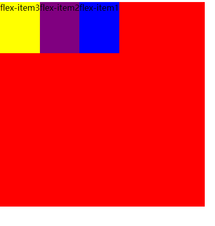

## order

###### order 决定了 flex items的排布顺序(不常用)

> 可以设置任意整数 值越小就越排在前面
>
> 默认值是0

例如：

```html
<style>
  .flex-container {
    display: flex;
    background-color: red;
    height: 400px;
    width: 400px;
  }

  .flex-item1 {
    background-color: blue;
    height: 100px;
    order: 10;
  }

  .flex-item2 {
    background-color: purple;
    height: 100px;
    order: 8;
  }

  .flex-item3 {
    background-color: yellow;
    height: 100px;
    order: 7;
  }
</style>

<div class="flex-container">
  <div class="flex-item1">flex-item1</div>
  <div class="flex-item2">flex-item2</div>
  <div class="flex-item3">flex-item3</div>
</div>
```

可以看到：

